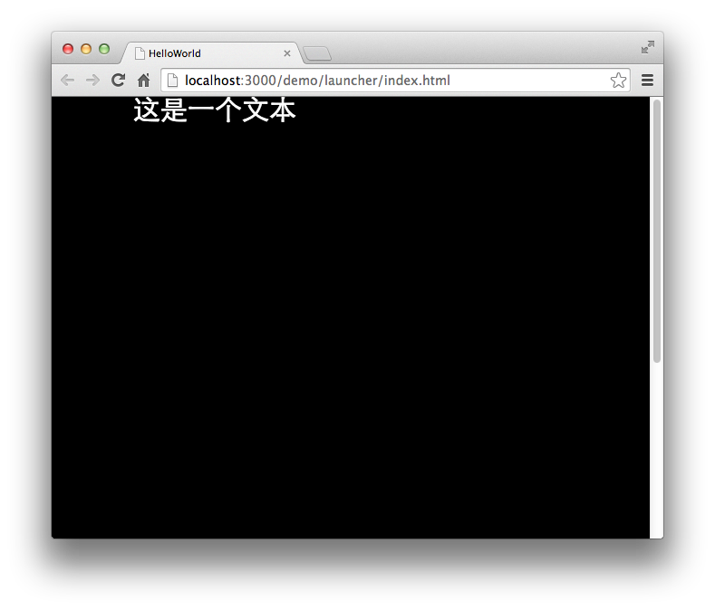
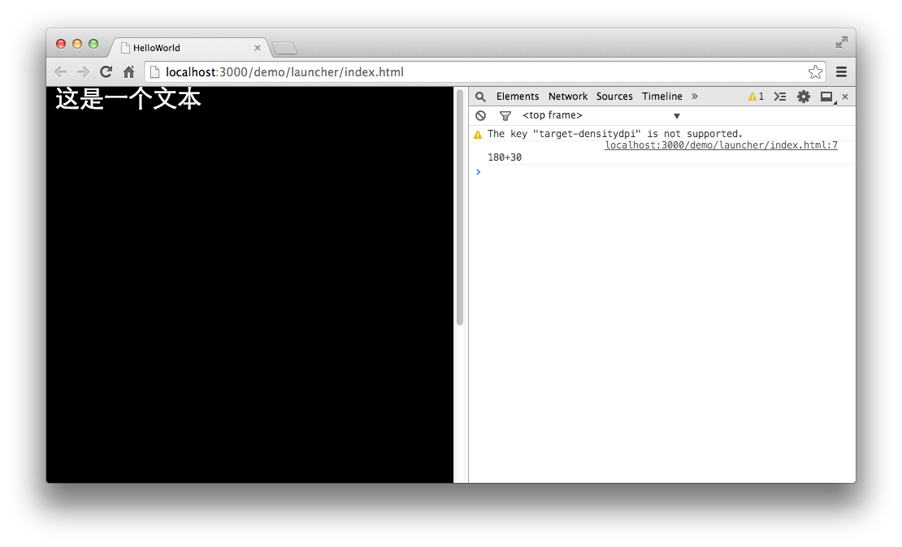

本文适用有 Egret 2.0 Final 以上版本

------

在Egret中，我们有三种类型的文本可以选择，分别为“普通文本”，“输入文本”和“位图文本”。 这些不同类型的文本在不同的场景下使用。对于不同类型的文本，其操作方式可能会有所不同。三种类型的文本特点如下：

* 普通文本：能够正常的显示各种文本，文本内容可以被程序设置，最为常见的文本类型。

* 输入文本：可以被用户输入的文本，常用于登陆中的输入框或者游戏中的聊天窗口。

* 位图文本：使用位图文字来渲染的文本，常用于游戏中需要加特殊字体效果的文本。

* 这篇文档中，我们以普通文本为例，介绍如何创建一个文本对象。

创建普通文本，我们可以直接创建一个 `TextField` ，并设置一些相关的属性，来控制我们的文本样式。我们添加如下代码：

```
var label:egret.TextField = new egret.TextField(); 
label.text = "这是一个文本"; 
this.addChild( label );
```

编译运行后效果如下：



我们来讲解一下这段代码，当我们创建一个 `TextField` 对象后，我们拥有了一个“普通文本”对象。这个文本对象在创建之初并没有任何 显示内容。而显示内容来自 `text` 属性。所以我们在第二行对文本内容进行了设置。也就是下面这句话：

```
label.text = "这是一个文本";
```

我们的内容设置为 “这是一个文本”。

由于 TextField 也继承自 DisplayObject （ 你可以参考[显示对象种类](http://edn.egret.com/cn/docs/page/566) 这篇文档，了解显示对象继承关系）,我们可以直接将 TextField 对象添加到显示列表中，如下面代码：

```
this.addChild( label );
```

作为一个显示对象应该有它自身的宽度与高度。那么刚才我们看到的文本它的宽高是多少呢？

为了找到我们的答案，我们在程序中继续编写代码：

```
console.log( label.width + "+" + label.height);
```

我们再次编译运行，在打开的浏览器中我们开启JavaScript控制台，效果如下：



我们在控制台中看到当前文本的宽度为100像素，高度为30像素。

事实上，我们的TextField对象默认宽高并非为100*30，当一个TextField被赋予一个文本的时候，TextField会自动计算出适合的大小。 这个“适合的大小”指的是“能够将当前文本全部显示出来的大小”。

我们将刚才文本中的文字改变一下，代码如下：

我们通过在文本中添加多个换行符\n，让刚才的文本从横向排列变为纵向排列。 编译并运行，效果如下：


此时我们看到，这个文本的宽度变为了 30像素，高度变为了180像素。


