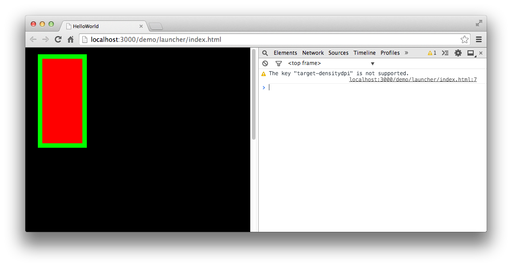

Egret中可以直接使用程序来绘制一些简单的图形，这些图形在运行时都会进行实时绘图。要进行绘图操作，我们需要使用 Graphics 这个类。但并非直接使用。 一些显示对象中已经包含了绘图方法，我们可以直接调用这些方法来进行绘图。 Graphics 中提供多种绘图方法。

* 绘制矩形

* 绘制圆形

* 绘制直线

* 绘制曲线

* 绘制圆弧

### 绘制矩形

我们可以使用 Shape 对象来学习绘图方法。下面是一个绘制矩形的示例：

```
class GraphicsTest extends egret.DisplayObjectContainer
{
    public constructor()
    {
        super();
        this.addEventListener(egret.Event.ADDED_TO_STAGE,this.onAddToStage,this);
    }
    private onAddToStage(event:egret.Event)
    {
        var shp:egret.Shape = new egret.Shape();
        shp.graphics.beginFill( 0xff0000, 1);
        shp.graphics.drawRect( 0, 0, 100, 200 );
        shp.graphics.endFill();
        this.addChild( shp );
    }
}
```

编译后运行，效果如图：


这段代码中最主要的绘图方法是下面这三行:

```
shp.graphics.beginFill( 0xff0000, 1); 
shp.graphics.drawRect( 0, 0, 100, 200 ); 
shp.graphics.endFill();
```

访问 `shp` 的 `graphics` 属性会返回一个 `Graphics` 对象，操作此对象中的绘图方法即可实现绘图。

调用 `beginFill` 方法是设置我们矩形的填充颜色，这里我们将填充颜色设置为红色（颜色值0xff0000），同时将`alpha`设置为1，表示完全不透明。

调用 `drawRect` 方法设置我们矩形的形状，我们绘制了一个 100*200 的矩形。

调用 `endFill` 方法表示结束当前绘制操作。

如果我们要对矩形添加一个描边，那么你可以设置线条的样式，通过 lineStyle 方法来进行设置。

我们可以为绘图代码添加一行:

```
shp.graphics.lineStyle( 10, 0x00ff00 );
```

该方法的第一个参数是描边的线条宽度，第二个参数为描边的颜色。

具体修改后的代码如下：

```
class GraphicsTest extends egret.DisplayObjectContainer
{
    public constructor()
    {
        super();
        this.addEventListener(egret.Event.ADDED_TO_STAGE,this.onAddToStage,this);
    }
    private onAddToStage(event:egret.Event)
    {
        var shp:egret.Shape = new egret.Shape();
        shp.x = 20;
        shp.y = 20;
        shp.graphics.lineStyle( 10, 0x00ff00 );
        shp.graphics.beginFill( 0xff0000, 1);
        shp.graphics.drawRect( 0, 0, 100, 200 );
        shp.graphics.endFill();
        this.addChild( shp );
    }
}
```

编译并运行，效果如图：



### 清空绘图

清空绘图操作是将已经绘制的图像全部清空，对于清空操作可以执行 Graphics 中的 clear 操作。

当需要清除一个对象的绘图时候，我们可以执行下面语句:

```
shp.graphics.clear();
```
