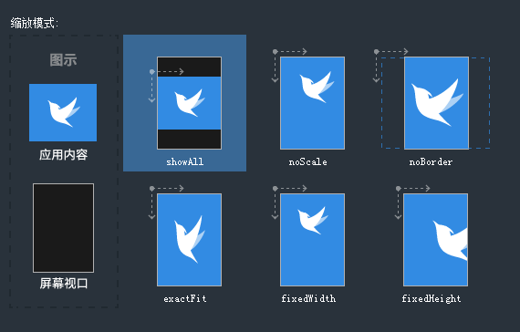
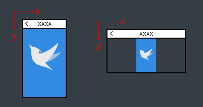

引擎在更新到2.4版本后，有6种屏幕缩放模式。有新增的，也有改变的(比如noBorder模式)。下面我们详细说一下它们的区别和效果。

>之前的适配策略请参考:[2.0 版本屏幕适配策略](http://edn.egret.com/cn20/index.php/article/index/id/181)

新版缩放模式在使用 wing 创建项目的时候可以很方便的选择，非常直观。



您也可以在创建好的项目里随时修改，具体的位置是 index.html 里的 body 部分，如下所示

```
<body> <div
        data-scale-mode="noScale" > </div> </body>```
你还可以在项目代码里随时修改
~~~
this.stage.scaleMode = egret.StageScaleMode.FIXED_WIDTH;
~~~


#### 各种模式的效果示意图

蓝色背景代表舞台尺寸，屏幕适配模式只解决舞台宽高和屏幕尺寸之间的关系。这只实现了完整屏幕适配的第一步，第二步是根据获得的舞台宽高去调整内部元素的位置。使用EUI的自适应流式布局将很容易实现第二步。

### showAll 模式
showAll 模式就是保持宽高比，显示全部内容。缩放后应用程序内容向较宽方向填满播放器窗口，另一个方向的两侧可能会不够宽而留有黑边。在此模式下，舞台尺寸(stage.stageWidth,stage.stageHeight)始终等于初始化时外部传入的应用程序内容尺寸。

目前的手机屏幕大部分都是16:9的，所以指定一个设计宽高尺寸，就可以在大部分移动设备有相接近的体验，这时使用 showAll 模式是一个比较简单的适配模式。

### noScale 模式
noScale 模式顾名思义，就是不对内容进行任何缩放，保持原始的1:1比例，然后直接把舞台对齐到浏览器的左上角。即使在更改播放器窗口大小时，它仍然保持不变。如果播放器窗口比内容小，则可能进行一些裁切。在此模式下，舞台尺寸（stage.stageWidth,stage.stageHeight）始终跟播放器窗口大小保持一致。

### noBorder 模式
noBorder 和之前版本的缩放模式是不一样的，原来的 noBorder 模式现在叫 fixedWidth ，后面会有说明。

noBorder 模式会根据屏幕的尺寸等比缩放内容，缩放后应用程序内容向较窄方向填满播放器窗口，不会有黑边存在，另一个方向的两侧可能会超出播放器窗口而被裁切，只显示中间的部分。

在此模式下，舞台尺寸(stage.stageWidth,stage.stageHeight)始终等于初始化时外部传入的应用程序内容尺寸。

### exactFit 模式
exactFit 模式是不保持原始宽高比缩放应用程序内容，缩放后应用程序内容正好填满播放器窗口。简单的说就是不按照原来内容的比例，直接拉伸，暴力填充整个屏幕。在此模式下，舞台尺寸(stage.stageWidth,stage.stageHeight)始终等于初始化时外部传入的应用程序内容尺寸。

### fixedWidth 模式
fixedWidth 模式是保持原始宽高比缩放应用程序内容，缩放后应用程序内容在水平和垂直方向都填满播放器窗口，但只保持应用程序内容的原始宽度不变，高度可能会改变。在此模式下，舞台宽度(stage.stageWidth)始终等于初始化时外部传入的应用程序内容宽度。舞台高度(stage.stageHeight)由当前的缩放比例与播放器窗口高度决定。

fixedWidth 就是老版本中的 noBorder 模式，是一般做游戏推荐的模式。宽度固定了，高度随屏幕自适应，可以获得最好的显示效果。

### fixedHeight 模式
fixedHeight 模式保持原始宽高比缩放应用程序内容，缩放后应用程序内容在水平和垂直方向都填满播放器窗口，但只保持应用程序内容的原始高度不变，宽度可能会改变。在此模式下，舞台高度(stage.stageHeight)始终等于初始化时外部传入的应用程序内容高度。舞台宽度(stage.stageWidth)由当前的缩放比例与播放器窗口宽度决定。

fixedHeight 是新增的一种缩放模式，和 fixedWidth 相反，高度固定，宽度随屏幕自适应。

------

在 Egret Engine 2.5.6 中新增了 fixedNarrow 和 fixedWide 两种缩放模式。在新增的屏幕缩放模式下，首先会填满屏幕不留黑边，缩放后可以保持原始的宽高比例不变，等比的缩放程序内容，缩放后应用程序向设定的方向来填满播放器窗口。舞台的高度和宽度由当前的缩放比例与播放器视口决定，可以根据舞台的高度和宽度来自适应布局。这两种缩放模式简单可以理解为fixedWidth和fixedHeight的高级封装，显示效果与那两种模式类似，但是决定缩放比例的方向不是定死的，而是根据内容距离屏幕的边距宽窄来决定。在这两种模式下可以比较方便的布局 UI。

### fixedNarrow 模式

保持原始宽高比缩放应用程序内容，缩放后应用程序内容在水平和垂直方向都填满播放器视口，应用程序内容的较窄方向可能会不够宽而填充。
在此模式下，舞台高度(Stage.stageHeight)和舞台宽度(Stage.stageWidth)由当前的缩放比例与播放器视口宽高决定。

### fixedWide 模式

保持原始宽高比缩放应用程序内容，缩放后应用程序内容在水平和垂直方向都填满播放器视口，应用程序内容的较宽方向的两侧可能会超出播放器视口而被裁切。
在此模式下，舞台高度(Stage.stageHeight)和舞台宽度(Stage.stageWidth)由当前的缩放比例与播放器视口宽高决定。


## 旋转模式
通过设置旋转模式，可以在浏览器因为重力感应发生旋转的时候，让内容根据你的要求随着变化。

新版旋转模式在创建项目的时候可以很方便的选择，非常直观。


和缩放模式一样，您也可以在 index.html 里的 body 部分修改，如下所示

```
<body> <div
        data-orientation="auto" > </div> </body>```
你还可以在项目代码里随时修改
~~~
this.stage.orientation = egret.OrientationMode.AUTO;
~~~

旋转模式目前有4种，下面我们就详细的说一下。
#### 效果图的缩放模式均为 showAll
### auto 模式


auto 模式很容易理解，不管横屏还是竖屏，都是从上到下的显示内容。

### portrait 模式

portrait 模式是始终以竖屏状态下手机的左上角为起点显示内容

### landscape 模式

landscape 和 portrait 类似，是始终以竖屏状态下手机的右上角为起点显示内容。

### landscapeFlipped 模式

landscapeFlipped 模式比较特殊，横屏状态下和 landscape 起点相同，竖屏状态下起点位置和 landscape 相反，从右上方变成了左下方。

landscape 和 landscapeFlipped 这两种模式，一般用于横屏游戏，但需要提示用户关闭重力感应锁，锁定屏幕方向。简单说就是竖屏状态下玩横屏游戏。