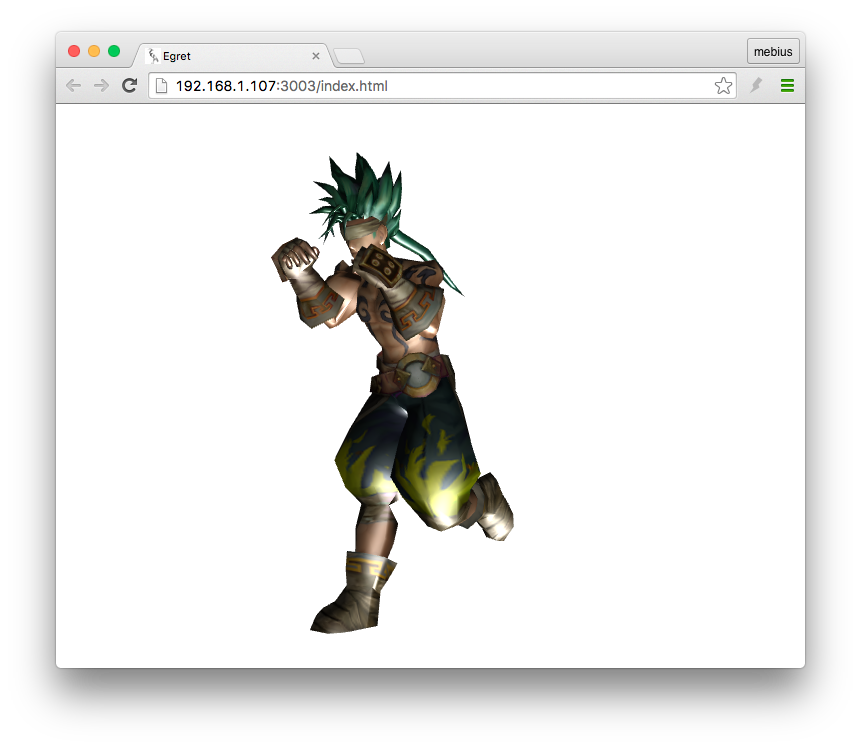
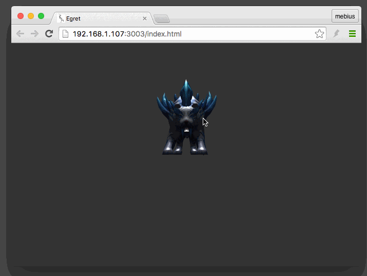

# Get Started


## IDE

首先是IDE的支持，今天所发布的新版本Wing 3.0.6第一次将Egret3D项目嵌入其中，你可以在Wing中直接创建Egret3D项目。


## 编译运行与发布



你可以使用Egret常用的命令，`egret build`对当前Egret3D项目进行编译操作。然后使用`egret run`命令来运行调试项目。

最后发布时，可以使用`egret publish`命令进行发布。


上图是默认项目的运行效果。

## 自己动手做个小Demo

我们来渲染一个好玩的野怪模型，同时为场景中增加灯光。

### 创建Egret3D项目

项目名称为`3ddemo`。

 

### 创建类文件

名称为`MyDemo.ts`，其中类名为MyDemo，并且类继承自LoadingUI。


## 开始编写我们自己的代码

### 创建egret3d.Egret3DCanvas对象。

Egret3DCanvas用于初始化我们的canvas标签，并启动WebGL渲染。

```
private _egret3DCanvas: egret3d.Egret3DCanvas;
    private createCanvas()
    {
        this._egret3DCanvas = new egret3d.Egret3DCanvas();
        this._egret3DCanvas.x = 0;
        this._egret3DCanvas.y = 0;
        this._egret3DCanvas.width = window.innerWidth;
        this._egret3DCanvas.height = window.innerHeight;
        this._egret3DCanvas.start();
    }
```

调用start()方法，则开启egret3d.Egret3DCanvas对象。

### 添加一个View3D

```
private _view:egret3d.View3D;
    private createView()
    {
        this._view = new egret3d.View3D(0,0,window.innerWidth,window.innerHeight);
        this._view.backColor = 0xff333333;
        this._view.camera3D.lookAt(new egret3d.Vector3D(500,500,-1000),new egret3d.Vector3D(0,0,0));
        this._egret3DCanvas.addView3D( this._view );
    }
```

View3D是Egre3D中的显示窗口，我们在View3D对象初始化的时候，需要填写的四个参数分别为窗口的x，y和宽高值。

backColor是当前显示窗口的背景颜色。需要注意的是，其中颜色值为ARGB，不要忘记前两位为Alpha信息。

最后我们设置其当前View3D中摄像机的位置与朝向，并将其添加到egret3d.Egret3DCanvas对象中。

### 加载esm模型文件

```
private loadModel()
    {
        var loader:egret3d.URLLoader = new egret3d.URLLoader();
        loader.addEventListener(egret3d.LoaderEvent3D.LOADER_COMPLETE,this.onLoad,this);
        loader.load("resource/laohu/Mon_04.esm");
    }
```

Egre3D内置一个URLLoader类，与2D中资源加载不同。

### 创建几何体，材质和Mesh对象。

```
private _mat:egret3d.TextureMaterial;
    private _mesh:egret3d.Mesh;
    private _geom:egret3d.Geometry;
    private onLoad(evt: egret3d.LoaderEvent3D)
    {
        this._geom = evt.loader.data;
        this._mat = new egret3d.TextureMaterial();
        this._mesh = new egret3d.Mesh(this._geom, this._mat);
        this._view.addChild3D( this._mesh );

        this.createLigth();

        var loader:egret3d.URLLoader = new egret3d.URLLoader();
        loader.addEventListener(egret3d.LoaderEvent3D.LOADER_COMPLETE,this.onTextureLoad,this);
        loader.load("resource/laohu/Mon_04.png");
    }
```

当加载模型完成后，我们得到的`evt.loader.data`数据，实际上就是一个`egret3d.Geometry`对象，里面包含了一个模型的UV0，UV1，法线，顶点等信息。这个类是我们的几何体。

同时还需要创建纹理材质（`egret3d.TextureMaterial`），纹理材质决定了一个物体对于光线的反射率，折射率等信息。

想要将我们的材质与模型组合到一起，需要使用`egret3d.Mesh`对象，也被称之为网格。现在你可以将其理解为3D场景中能被渲染的看得见的物体对象。

最后我们通过View3D中的`addChild3D()`方法，将Mesh对象放入到显示窗口中。

注意，其中的`createLigth`方法是创建灯光

### 创建灯光

```
private createLigth()
    {
        var lightGroup:egret3d.LightGroup = new egret3d.LightGroup();
        var light:egret3d.DirectLight = new egret3d.DirectLight(new egret3d.Vector3D(0, -1, 0));
        lightGroup.addLight(light);
        light.diffuse = 0xffffffff;
        light.intensity = 1;
        this._mesh.material.lightGroup = lightGroup;
    }
```

灯光在使用时需要先创建一个灯光组对象（`egret3d.LightGroup`）。然后将我们创建的平行光加入到这个灯光组当中。

最后一句 `this._mesh.material.lightGroup = lightGroup;` 是将当前灯光组与我们前面创建的 Mesh 对象绑定。这样，当前灯光组中的灯光效果会直接作用到我们的这个Mesh对象中。

> 注：平行光是一种有方向，有颜色，有强度的灯光。

### 设置漫反射贴图

```
private onTextureLoad(evt: egret3d.LoaderEvent3D)
    {
        var texture:egret3d.ImageTexture = evt.loader.data;
        this._mat.diffuseTexture = texture;
    }
```

纹理贴图下载完成后，设置材质的漫反射贴图。

### 添加摄像机控制器

> 需要注意的是，我们需要监听_egret3DCanvas对象的ENTER_FRAME事件，用于刷新我们的摄像机控制器。

```
private _cameraCtl:egret3d.LookAtController;
    private createCameraCtl()
    {
        this._cameraCtl = new egret3d.LookAtController(this._view.camera3D,new egret3d.Object3D());
        this._cameraCtl.distance = 1000;

        this._egret3DCanvas.addEventListener(egret3d.Event3D.ENTER_FRAME,this.update,this);
    }

public update(evt: egret3d.Event3D) {
        this._cameraCtl.update();
    }
```

`this._cameraCtl.distance = 1000;` 用于设置摄像机到被观察物体之间的距离。

### 添加针对网页尺寸变化的侦听器

```
private OnWindowResize(evt: egret3d.Event3D): void {
        this._egret3DCanvas.width = window.innerWidth;
        this._egret3DCanvas.height = window.innerHeight;
        this._view.width = window.innerWidth;
        this._view.height = window.innerHeight;
    }
```

### 在`constructor`方法中调用我们编写的代码。

```
public constructor()
    {
        super();

        this.CloseLoadingView();
        this.createCanvas();
        this.createView();
        this.loadModel();
        this.createCameraCtl();

        egret3d.Input.addEventListener(egret3d.Event3D.RESIZE,this.OnWindowResize,this);
    }
```

最后，修改Main.ts文件中的代码，如下：

```
class Main extends egret.DisplayObjectContainer {

    public constructor() {
        super();
        var sample = new MyDemo();
    }
}
```

执行`egret b`命令，编译后，运行查看效果。



按住鼠标并拖拽，可以旋转摄像机，从各个角度查看模型。使用滚轮，可以调整摄像机与模型之间的距离。

> 备注：我们所加载的esm文件，为Egre3D所自定义的3D模型文件。你可以使用我们提供的插件在3D Max 2012中导出你想要的模型文件。

完整代码如下：

```
class MyDemo extends LoadingUI
{
    public constructor()
    {
        super();
        
        this.CloseLoadingView();
        this.createCanvas();
        this.createView();
        this.loadModel();
        this.createCameraCtl();
        
        egret3d.Input.addEventListener(egret3d.Event3D.RESIZE,this.OnWindowResize,this);
    }
    
    private _egret3DCanvas: egret3d.Egret3DCanvas;
    private createCanvas()
    {
        this._egret3DCanvas = new egret3d.Egret3DCanvas();
        this._egret3DCanvas.x = 0;
        this._egret3DCanvas.y = 0;
        this._egret3DCanvas.width = window.innerWidth;
        this._egret3DCanvas.height = window.innerHeight;
        this._egret3DCanvas.start();
    }
    
    private _view:egret3d.View3D;
    private createView()
    {
        this._view = new egret3d.View3D(0,0,window.innerWidth,window.innerHeight);
        this._view.backColor = 0xff333333;
        this._view.camera3D.lookAt(new egret3d.Vector3D(500,500,-1000),new egret3d.Vector3D(0,0,0));
        this._egret3DCanvas.addView3D( this._view );
    }
    
    private loadModel()
    {
        var loader:egret3d.URLLoader = new egret3d.URLLoader();
        loader.addEventListener(egret3d.LoaderEvent3D.LOADER_COMPLETE,this.onLoad,this);
        loader.load("resource/laohu/Mon_04.esm");
    }
    
    private _mat:egret3d.TextureMaterial;
    private _mesh:egret3d.Mesh;
    private _geom:egret3d.Geometry;
    private onLoad(evt: egret3d.LoaderEvent3D)
    {
        this._geom = evt.loader.data;
        this._mat = new egret3d.TextureMaterial();
        this._mesh = new egret3d.Mesh(this._geom, this._mat);
        this._view.addChild3D( this._mesh );
        
        this.createLigth();
        
        var loader:egret3d.URLLoader = new egret3d.URLLoader();
        loader.addEventListener(egret3d.LoaderEvent3D.LOADER_COMPLETE,this.onTextureLoad,this);
        loader.load("resource/laohu/Mon_04.png");
    }
    
    private onTextureLoad(evt: egret3d.LoaderEvent3D)
    {
        var texture:egret3d.ImageTexture = evt.loader.data;
        this._mat.diffuseTexture = texture;
    }
    
    private createLigth()
    {
        var lightGroup:egret3d.LightGroup = new egret3d.LightGroup();
        var light:egret3d.DirectLight = new egret3d.DirectLight(new egret3d.Vector3D(0, -1, 0));
        lightGroup.addLight(light);
        light.diffuse = 0xffffffff;
        light.intensity = 1;  
        this._mesh.material.lightGroup = lightGroup;
    }
    
    private _cameraCtl:egret3d.LookAtController;
    private createCameraCtl()
    {
        this._cameraCtl = new egret3d.LookAtController(this._view.camera3D,new egret3d.Object3D());
        this._cameraCtl.distance = 1000;
        
        this._egret3DCanvas.addEventListener(egret3d.Event3D.ENTER_FRAME,this.update,this);
    }
    
    public update(evt: egret3d.Event3D) {
        this._cameraCtl.update();
    }
    
    private OnWindowResize(evt: egret3d.Event3D): void {
        this._egret3DCanvas.width = window.innerWidth;
        this._egret3DCanvas.height = window.innerHeight;
        this._view.width = window.innerWidth;
        this._view.height = window.innerHeight;
    }
}
```

